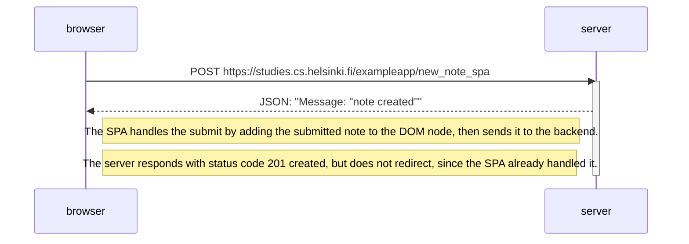

```mermaid

sequenceDiagram
    participant browser
    participant server

    browser->>server: POST https://studies.cs.helsinki.fi/exampleapp/new_note_spa
    activate server
    server-->>browser: JSON: "Message: "note created"" 
    Note right of browser: The SPA handles the submit by adding the submitted note to the DOM node, then sends it to the backend.
    Note right of browser: The server responds with status code 201 created, but does not redirect, since the SPA already handled it.
    deactivate server
    
```
